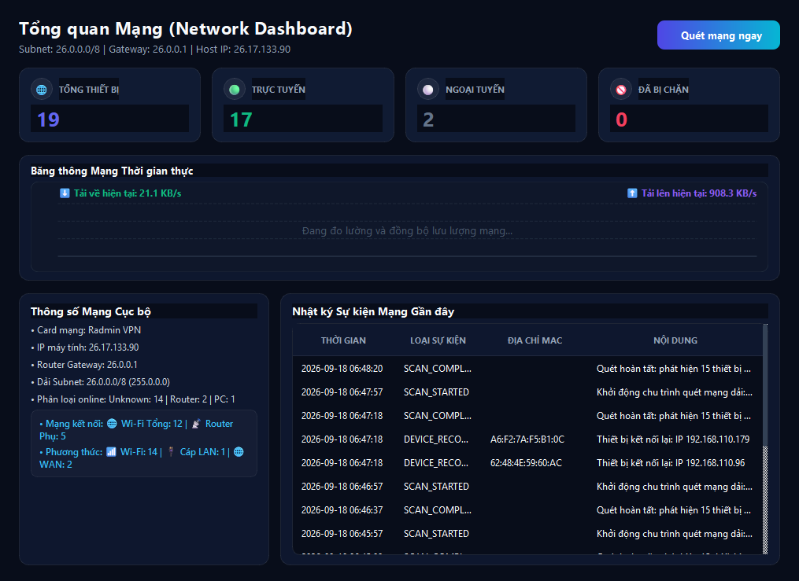
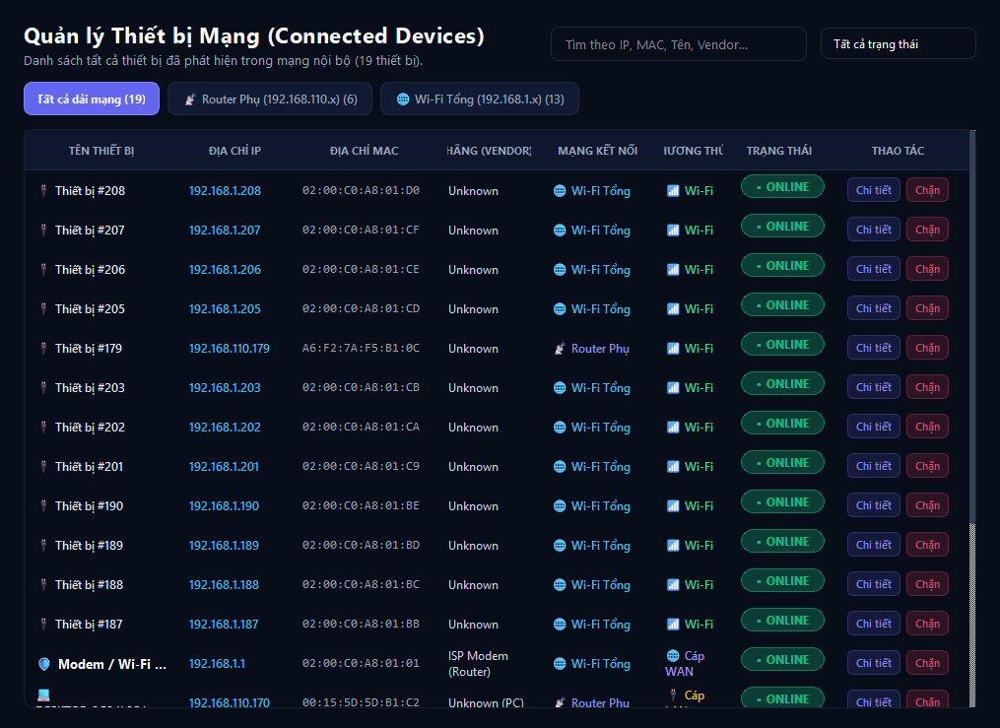
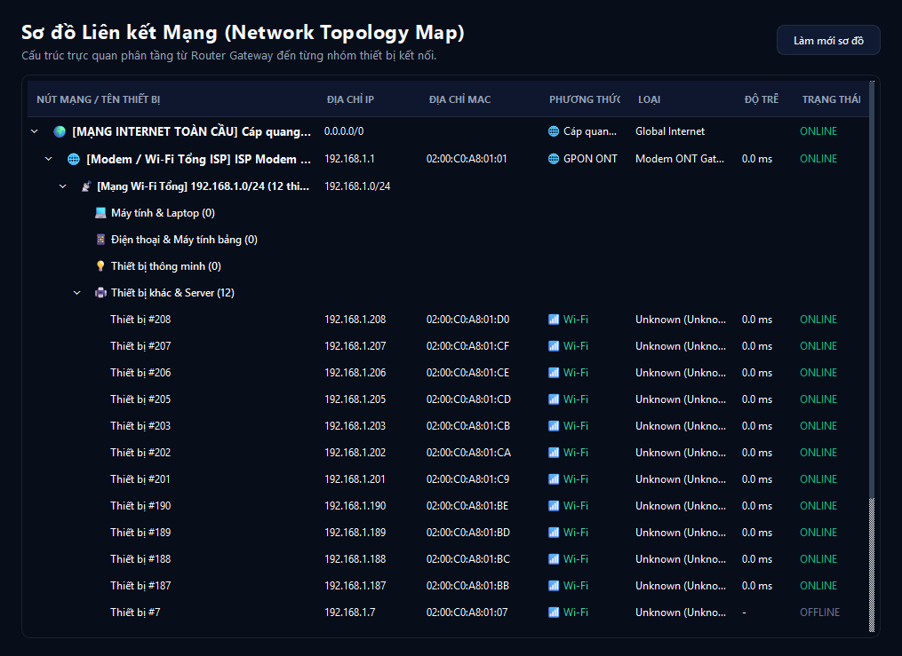
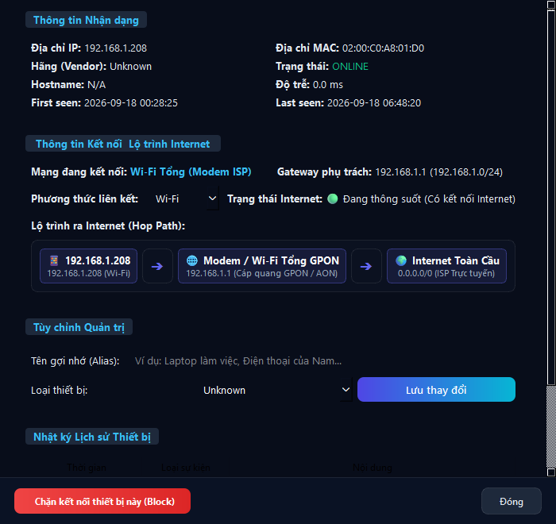

# NETWORK MANAGER (Local Network Management & Monitoring Suite)

A professional local network (LAN/WLAN) scanning, monitoring, and management system designed for network administrators, developed using **Python**, **PySide6**, **Nmap / Native ARP**, and **SQLite**.

The application automatically discovers all active devices across subnets, collects IP and MAC addresses, resolves hostnames, identifies hardware manufacturers (Vendor) via OUI lookup, tracks real-time Online/Offline statuses, monitors bandwidth/traffic speeds, visualizes network topology and Internet connection routes, and manages device access blocking/unblocking via Router Adapters (TP-Link, OpenWrt, MikroTik, Mock Mode) combined with Windows Host Firewall.

---

## Key Features

1. **Hybrid Multi-Method Network Scanner**:
   - Automatically detects active network interfaces, local station IP, default Gateway, and calculates CIDR subnets (`/24`, etc.).
   - High-speed Nmap ARP ping scanner with accurate XML parsing.
   - Built-in multithreaded Native ARP + ICMP Ping fallback engine when Nmap is unavailable or running with standard user privileges.

2. **Intelligent Device Identification & Classification**:
   - Built-in OUI MAC vendor database (Apple, Samsung, Intel, TP-Link, Xiaomi, Espressif IoT, Realtek, Dell, HP, MikroTik, Cisco, etc.).
   - Automatic device categorization: *PC / Laptop*, *Smartphone / Tablet*, *Router / Gateway*, *IoT Smart Device*, *Printer*, *Server*.

3. **Network Topology & Internet Connection Method Analysis**:
   - **Connected Network Detection**: Automatically maps devices to their parent network zone (e.g., *Main ISP Modem / Wi-Fi* vs. *Secondary Sub-Router / Room AP*).
   - **Physical Link Medium**: Identifies physical link types (`📶 Wi-Fi`, `🔌 Ethernet LAN`, `🌐 WAN Uplink`).
   - **Internet Hop Routing**: Visualizes the hop-by-hop transmission route from device through access points and gateways out to the global Internet.

4. **Real-Time Traffic Monitoring & Live Waveform Chart**:
   - Real-time download and upload bandwidth tracking.
   - Interactive smoothed waveform chart on the Dashboard with dynamic scaling and anti-collision legend display.

5. **SQLite Database & Event Auditing**:
   - Stores device catalog with `first_seen`, `last_seen`, and status (`ONLINE`, `OFFLINE`, `BLOCKED`).
   - Automatically records audit events: Device Joined (`DEVICE_JOINED`), Device Disconnected (`DEVICE_LEFT`), IP Changed (`IP_CHANGED`), Blocked (`BLOCKED`), and Unblocked (`UNBLOCKED`).

6. **Device Blocking & Access Control (Block / Unblock)**:
   - **Router Adapters**: Direct hardware-level network blocking (MAC Filtering / ACL / IP Firewall) for TP-Link, OpenWrt, and MikroTik routers.
   - **Mock Router Mode**: Safe simulation mode for testing, demonstration, and development without physical router credentials.
   - **Windows Host Firewall**: Automatically manages bidirectional (Inbound & Outbound) firewall block rules on the administrative machine.

7. **Modern Bilingual UI (English 🇬🇧 & Vietnamese 🇻🇳)**:
   - **Instant Language Switching**: Toggle between **English** and **Tiếng Việt** directly from the top bar or settings without restarting the application.
   - **Dashboard**: High-resolution MetricCards (Total, Online, Offline, Blocked), network metadata chips, live traffic chart, and recent event stream.
   - **Devices Table**: 8-column balanced, responsive layout with full MAC visibility, customizable aliases, vendor tags, and guaranteed visible action buttons.
   - **Device Details**: Frameless scrollable dialog displaying hardware parameters, editable connection types, visual breadcrumb hop path, and pinned action bar.
   - **Network Map**: Hierarchical tree topology displaying Global Internet -> Main ISP Modem -> Sub-Routers -> Endpoints.
   - **Blacklist & Settings**: Dedicated blocked devices management and network configuration (custom subnets, scan intervals, router credentials, connection testing).

8. **Standalone Windows Executable Packaging**:
   - One-click build script (`build_app.py` / `build.bat`) using PyInstaller to produce a self-contained `dist/NetworkManager/NetworkManager.exe` ready for distribution without requiring a Python runtime.

---

## Giao diện ứng dụng (Screenshots)

| Tổng quan hệ thống (Dashboard) | Quản lý thiết bị kết nối (Devices) |
| :---: | :---: |
|  |  |
| **Sơ đồ mạng đa tầng (Network Map)** | **Chi tiết & Lộ trình Internet (Device Details)** |
|  |  |

---

## Directory Structure

```text
Control-wifi/
├── main.py                    # Application entry point (GUI / CLI)
├── run.bat                    # Windows quick-launch script
├── run_admin.bat              # Launch with Administrator privileges
├── requirements.txt           # Python dependencies
├── README.md                  # Project documentation
├── LICENSE                    # MIT License
├── config/
│   ├── config.json            # Scanner, timing, and app configuration
│   └── routers.json           # Router credentials and adapter profiles
├── core/
│   ├── scanner.py             # Nmap XML & Native ARP/Ping network scanner
│   ├── device.py              # Device data model
│   ├── network.py             # Network interface, gateway, and subnet resolver
│   ├── topology.py            # Network topology & hop-route analyzer
│   ├── traffic.py             # Real-time traffic monitor
│   ├── monitor.py             # State tracking and database synchronization
│   ├── i18n.py                # Internationalization dictionary (VI / EN)
│   └── logger.py              # Centralized rotating log system
├── docs/
│   └── screenshots/           # Application UI screenshots
├── gui/
│   ├── app.py                 # Main window, navigation sidebar, and top bar
│   ├── theme.py               # Modern dark theme styles & widgets (QSS)
│   ├── dashboard.py           # Overview metrics, info chips, and event table
│   ├── devices.py             # 8-column responsive device table
│   ├── device_detail.py       # Scrollable device inspector with pinned actions
│   ├── network_map.py         # Hierarchical tree topology view
│   ├── traffic_chart.py       # Real-time bandwidth wave chart
│   ├── blocked.py             # Blacklist management view
│   └── settings.py            # Configuration and router test panel
├── router/
│   ├── base.py                # Abstract BaseRouterAdapter
│   ├── tplink.py              # TP-Link Access Control adapter
│   ├── openwrt.py             # OpenWrt (LuCI / ubus / iptables) adapter
│   ├── mikrotik.py            # MikroTik RouterOS adapter
│   └── mock.py                # Safe simulation mock adapter
├── scripts/
│   ├── build.bat              # One-click PyInstaller build script
│   ├── build_app.py           # Automated packaging and deployment script
│   ├── create_desktop_shortcut.bat # Desktop shortcut generator
│   ├── create_shortcut.ps1    # PowerShell shortcut helper
│   ├── run_cli_scan.bat       # Quick command-line network scan
│   └── setup_env.bat          # Auto venv setup & dependency installer
├── security/
│   ├── firewall.py            # Windows Host Firewall rule manager
│   ├── blocker.py             # Unified BlockManager coordinator
│   └── rules.py               # Blocking rule definitions
├── database/
│   ├── database.py            # SQLite connection manager & migrations
│   ├── devices.py             # Device DAO
│   └── events.py              # Event DAO
├── services/
│   ├── discovery.py           # Multithreaded network discovery service
│   ├── identification.py      # MAC OUI lookup & device classification
│   └── scheduler.py           # Background periodic scan worker (QThread)
├── tests/
│   └── test_all.py            # Complete automated test suite
├── utils/
│   ├── command.py             # Safe subprocess execution without console popups
│   ├── network_utils.py       # Ping, ARP table parsing, reverse DNS
│   └── validators.py          # IP, MAC, CIDR format validators
└── data/
    ├── network.db             # SQLite database
    └── logs/                  # Application log files
```

---

## Installation & Setup

### System Requirements
- Operating System: Windows 10 / 11 (or Linux / macOS)
- Python 3.12 or higher
- Nmap (optional, highly recommended for maximum scanning speed): Download at [nmap.org](https://nmap.org/download.html)

### Step 1: Create Virtual Environment
```powershell
py -3.12 -m venv venv
.\venv\Scripts\activate
```

### Step 2: Install Dependencies
```powershell
pip install -r requirements.txt
```

### Step 3: Launch Application

#### Run Graphical User Interface (GUI):
```powershell
python main.py
```
*Or double-click **`run.bat`** on Windows.*

#### Run Command-Line Interface (CLI Scanner):
```powershell
python main.py --cli
```
*Or specify a custom subnet:*
```powershell
python main.py --cli --subnet 192.168.1.0/24
```

---

## Windows Utility Batch Scripts

The project includes convenient `.bat` scripts for quick one-click operation on Windows:

| Script File | Purpose |
| :--- | :--- |
| **`run.bat`** | Launches the application (prioritizes standalone `.exe` if built, falls back to Python). |
| **`run_admin.bat`** | Launches with Administrator privileges (optimal for Windows Firewall and raw packet scans). |
| **`scripts/run_cli_scan.bat`** | Performs a fast terminal scan, printing discovered IP and MAC addresses in console. |
| **`scripts/create_desktop_shortcut.bat`** | Creates a "Network Manager" shortcut icon directly on the Windows Desktop. |
| **`scripts/build.bat`** | Packages the entire project into a standalone `NetworkManager.exe`. |
| **`scripts/setup_env.bat`** | Automatically initializes virtualenv and installs dependencies on a fresh machine. |

---

## Packaging Standalone Executable (`.exe` on Windows)

1. Double-click **`scripts/build.bat`**, or execute in PowerShell:
   ```powershell
   python scripts/build_app.py
   ```
2. Upon completion, the standalone distribution folder is generated at:
   ```text
   dist/NetworkManager/NetworkManager.exe
   ```
   You can copy the entire `dist/NetworkManager/` folder to any other Windows computer and run it immediately without installing Python!

---

## User Guide

1. **Initial Network Scan**:
   - Upon startup, Network Manager automatically detects your local subnet (e.g., `192.168.1.0/24` or `192.168.110.0/24`) and initiates an initial discovery scan.
   - Click **"Scan Network"** on the Dashboard at any time to perform an on-demand refresh.
2. **Assign Device Aliases**:
   - Navigate to the **"Devices"** tab and click **"Details"** on any target device.
   - Enter a friendly custom alias (e.g., *Work Laptop*, *Personal iPhone*, *Living Room Camera*) and click **"Save Changes"**.
3. **Inspect Connection & Internet Route**:
   - In the **"Device Details"** dialog, inspect the **"Connection Information & Internet Route"** section to view which AP the device is connected to, its physical medium (`Wi-Fi` / `Ethernet`), and its hop-by-hop route to the Internet.
4. **Block Device (Access Control)**:
   - In the device list or detail dialog, click **"Block"**.
   - A confirmation dialog will prompt for confirmation. Once confirmed, the block rule is pushed to the active Router Adapter (MAC blacklist / ACL) and added to the Windows Host Firewall.
   - Blocked devices move to the **"Blocked"** tab and are highlighted with a red badge in the Network Map.
5. **Unblock Device**:
   - Navigate to the **"Blocked"** tab or the device detail dialog and click **"Unblock"**. The device will be removed from router blacklists and firewall rules, restoring normal connectivity.
6. **Configure Physical Router Adapters**:
   - Go to **"Settings"** -> **"Router Adapter Configuration"**.
   - Select your router model (TP-Link, OpenWrt, MikroTik).
   - Enter the Gateway IP, administrative username, and password.
   - Click **"Test Router Connection"** to verify authentication before saving.

---

## Legal Disclaimer & Responsible Use

> [!CAUTION]
> This software is designed exclusively for network administration, monitoring, security auditing, and authorized management of networks that you own or are legally authorized to administer. Unauthorized scanning, interference, or tampering with networks without explicit permission from the owner is strictly prohibited.
